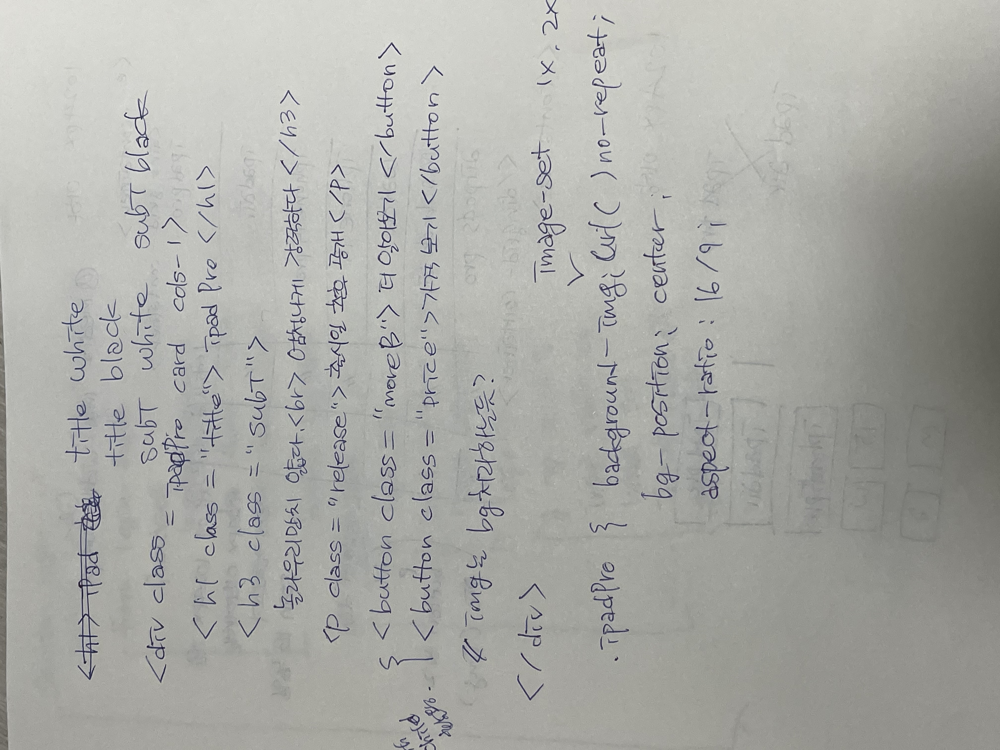
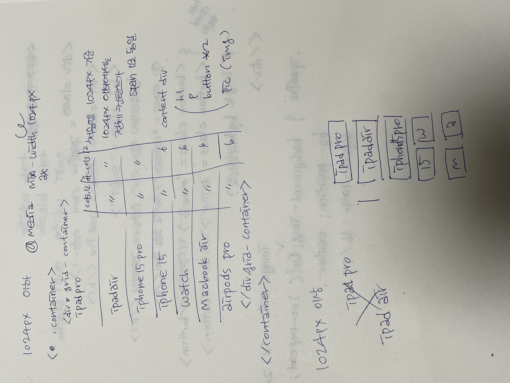

# 0516 apple 카드 - grid 사용 과제 구현 설명
## 마크업




1. 전체를 감싸는 div.container를 첫번째로 생성하였습니다.
2. 그 다음, grid 구현을 위해 div.main 생성 후 grid-container라는 class를 지정하였습니다.
3. group 역할을 할 div.card 7개를 만들고, card의 background를 다르게 하기 위해 카드 컴포넌트 각각의 class와 grid 지정 class도 부여하였습니다.

```
 <div class="ipadPro card cols-1" role="group">
          <h1 class="title white">iPad Pro</h1>
          <div class="subTarea">
            <h3 class="subT white">놀라우리만치 얇다.</h3>
            <h3 class="subT white">엄청나게 강력하다.</h3>
          </div>
          <p class="release">출시일 추후 공개</p>
          <ul>
            <li>
              <button class="more blue">더 알아보기</button>
            </li>
            <li>
              <button class="price1">
                가격 보기
              </button>
            </li>
          </ul>
        </div>
```

> - 제품명은 컴포넌트의 제목이라 생각하여 h1을 사용하였습니다.
> - 부제목은 h3을 사용하였으며, 부제목 줄바꿈이 존재하는 카드 컴포넌트는 div.subTarea로 한 번 감싸주었습니다.
> - 카드 컴포넌트의 구성은 모두 동일하게 가져가되, 글씨와 버튼의 색상이 두가지가 있기 때문에 각 색상 class를 추가 지정하였습니다.
> - button 두 개를 나란히 정렬하기 위해 ul > li를 사용하였습니다.

## 스타일링

1. div.container에 display: flex와 flex-flow: column nowrap을 지정해주었습니다.
2. main에는 flex 1 0 auto와 gap을 지정해주었습니다.
3. card에는 max-width와 각 카드의 height, justify-content와 text-align으로 카드 컴포넌트 안 내용을 가운데 정렬 시켰습니다.
4. 각 카드의 bg는 background-image image-set을 이용하여 1배, 2배를 사용하였습니다.
5. 모바일 비율 우선 설정 후 1024px 이상시 변경되는 부분을 지정하였습니다.

## 느낀점

카드 컴포넌트 내 class를 조금 더 적게 사용하여 더 간결하고 접근성 높은 구조를 작성할 수 있을 것 같아서 조금 더 고민해봐야 할 것 같습니다 ㅜㅜ...

확실히 손코딩으로 제대로 해보니 조금 더 마크업 구조에 대한 이해도가 올라간 것 같습니다!

또한 이전 과제 피드백에서 말씀해주신 컴포넌트와 레이아웃을 분리하여 작성하라고 하신 부분을 지켜보고자 했는데 이게 맞는건지는 잘 모르겠습니다.. 더 공부가 필요한 것을 확실히 느꼈습니다 ㅠ ㅠ
