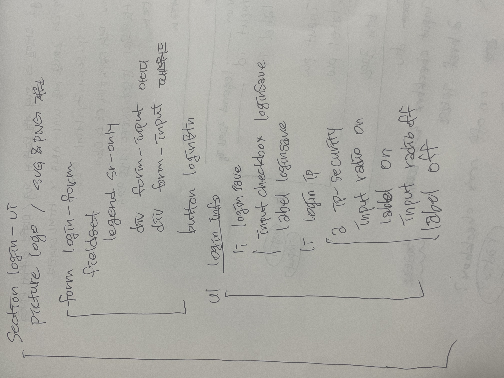
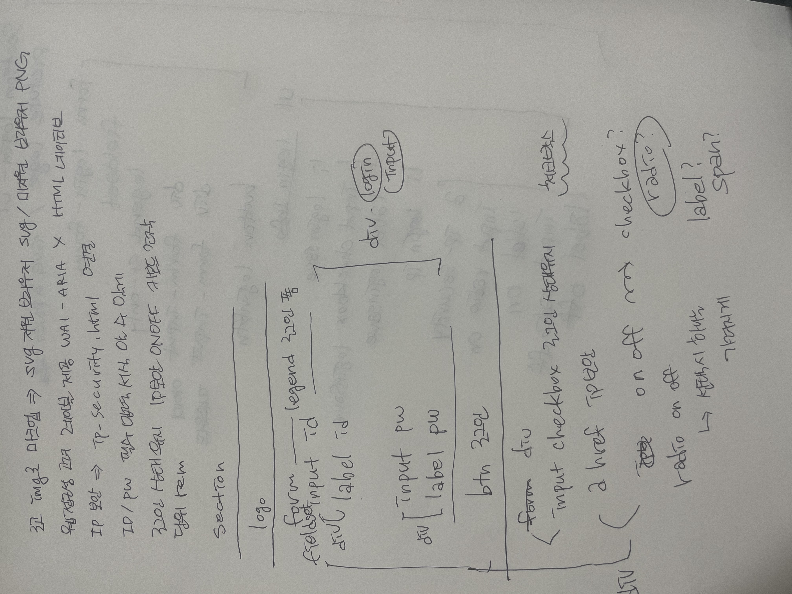

** 과제 구현 내용에 대한 설명을 작성해 주세요 **

# 마크업
과제 조건을 모두 만족하면서 지난번 과제 피드백으로 들은 role과 label을 적절히 사용하고자 하였습니다.

구조를 어떻게 짜야 좋을까 생각하다가 손코딩, 손으로 직접 그려보는것도 이해에 많이 도움이 된다고 하셔서 손으로 직접 작성해보며 div를 반드시 필요한 부분에서만 사용하고자 하였습니다.

로그인 상태유지와 IP보안은 정렬을 어떻게 하면 좋을까 고민하다 ul li 요소를 사용하여 정렬하였습니다.

IP보안 ON/OFF는 radio 버튼을 사용하는게 맞다고 생각하였고, 둘 중 체크되지 않은 것은 css를 사용하여 보이지 않게 하기 위해 checked 를 사용하여 off를 먼저 체크하도록 하였습니다.

# 스타일링

수업시간에 배운 :root를 이용하여 컬러 변수들을 지정하였습니다.

input radio 기본 버튼을 숨기고자 display:none을 사용하였더니  focus-visible이 작동하지 않는 문제를 파악하여 opacity:0, appearance: none등을 활용해봤지만 여전히 작동하지 않아 해당 문제는 고칠수 없었습니다 ㅜㅜ

개인 일정이 있어 구현 내용에 대한 설명 자세하게 서술하지 못한 점 죄송합니다..!
